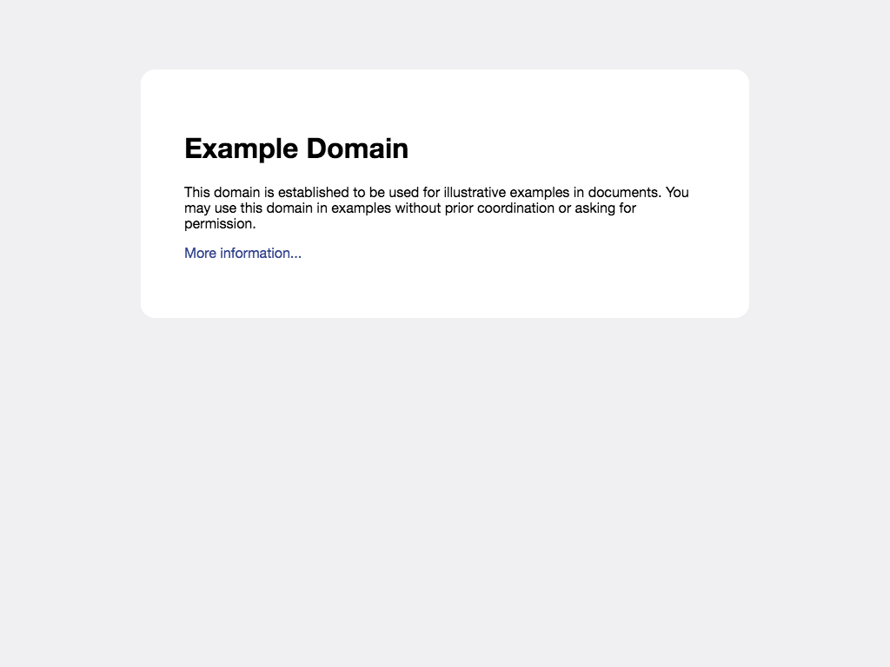
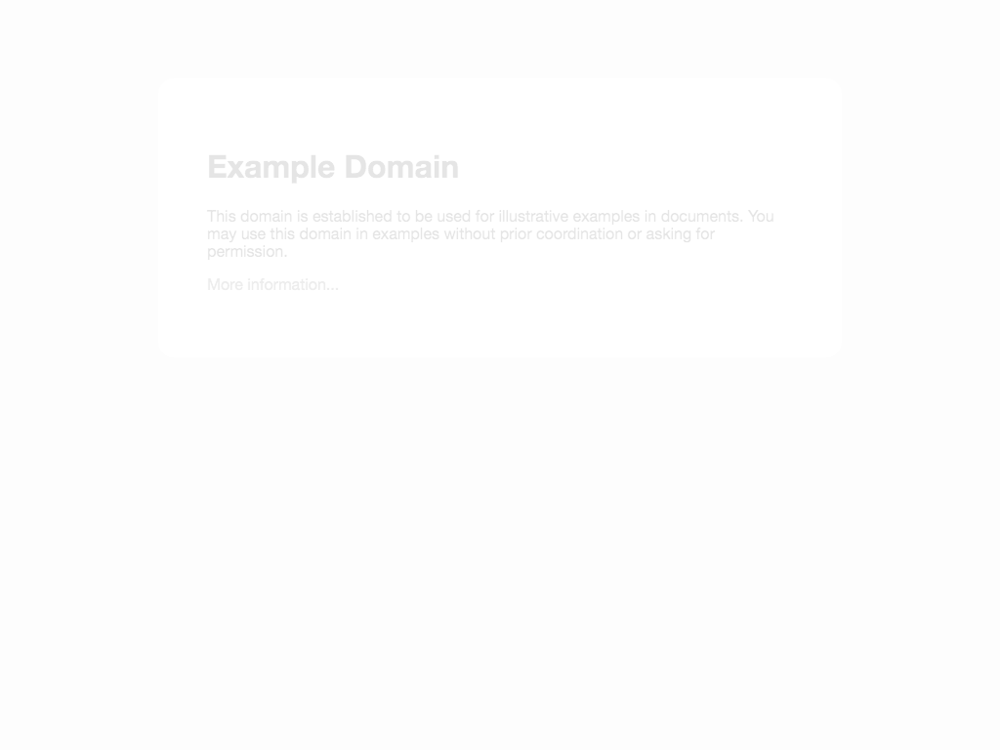
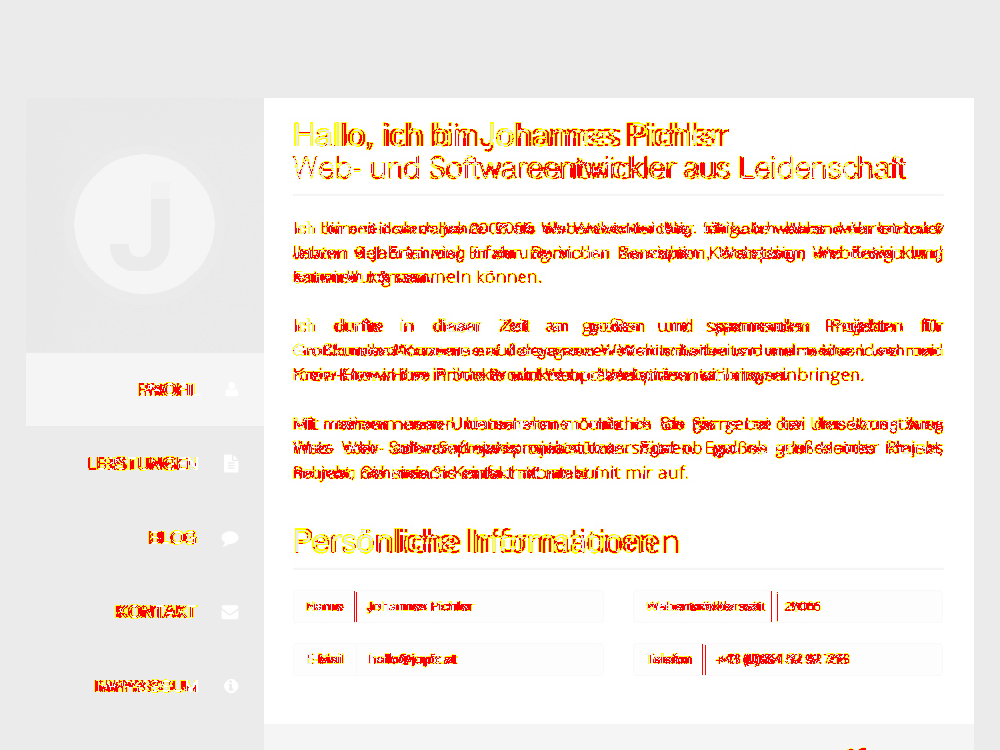

# critical-cli
critical-cli is a CLI tool for validating critical CSS on a certain website.

Basically the website is loaded without stylesheets at first and compared against a version with loaded stylesheets. If the generated screenshots do not match the critical CSS on the page is considered as incorrect. The tool will show the difference in percent on the standard output

## Installation
```
npm i critical-cli --save-dev
```

## Usage
The CLI application provides a run command to validate critical CSS:

```
critical-cli run --url https://johannespichler.com
```

If the critical CSS validation for the page fails the application will immediately exit with an exit code of `1`. All remaining URLs will not be checked.

## Configuration
The following configuration options can be passed to the `run` command.

| Option | Default | Description |
| -------- | -------- | -------- |
| url | N/A | the URL(s) to check |
| output | `./screenshots` | output path for page screenshots |
| width | 1024 | viewport width used for critical CSS comparison |
| height | 768 | viewport height used for critical CSS comparison |
| timeout | 1000 | timeout in milliseconds for loading stylesheets |
| cleanup | false | flag to cleanup output folder before run |

**Example:**
```
critical-cli run --url https://johannespichler.com --output ./other-dir --width 1920 --height 1080 --timeout 5000
```

## Configuration with JSON
By passing the `--config <filename>` option you can define your command parameters in a JSON file. This JSON file can contain all valid cli options.

**Example JSON:**

```json
{
    "url": [
        "https://example.com",
        "https://johannespichler.com"
    ],
    "width": 1920,
    "height": 1080
}
```

**Invocation:**
```
critical-cli run --config critical.json
```

## Output
The CLI generates a screenshot of the website with its critical CSS and a screenshot with all stylesheets loaded, also a diff image is generated.

| Critical Version | Normal Version | Diff |
| -------- | -------- | -------- |
|  |  |  |
|  |  |  |

This makes it easy to determine the problems with your critical CSS.

## License
The MIT License (MIT). Please see the [License File](LICENSE) for more information.